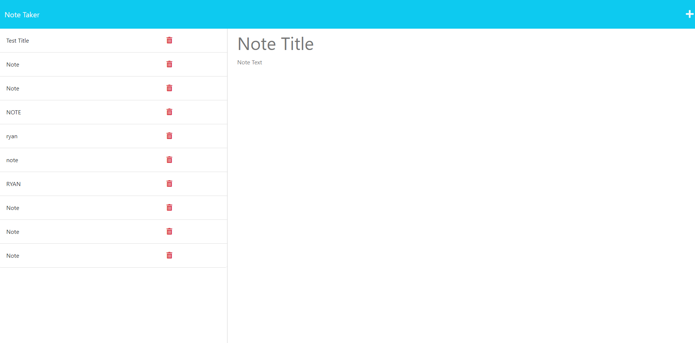

# NoteTaker

- [website](https://notetaker-ryan-efb50b61e834.herokuapp.com/)

## Description
this project is a database oriented notetaker. Some of the things I learned are how to connect the frontend index.js to the backend server.js file with a modularized route.js file.

## Table of Contents
- [Installation](#installation)
- [Usage](#usage)
- [Credits](#credits)
- [License](#license)
## Installation

N/A

## Usage

## Credits

N/A

## License

## Badges

## Features

Notes taken and submitted through a database.

## How to Contribute
    
- Ryan.business.bowen@gmail.com
- [GitHub](https://github.com/RyanTheScholar)
## Tests
N/A